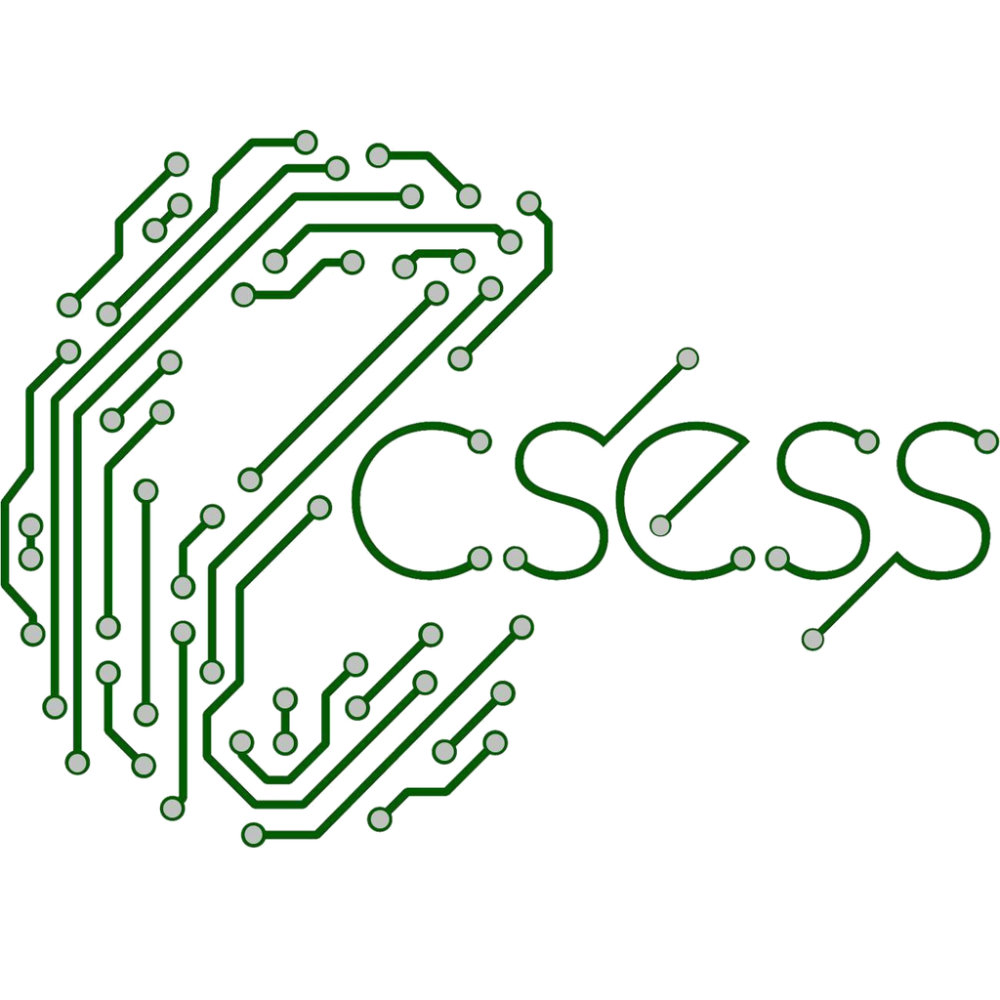

# ECSplore First Year Mentoring Program 2019

Bonjour hi! First of all, thank you so so so much for signing up to be a mentor! You’re helping to make ECSESS a better community.

## Program Overview
This new program is to welcome incoming ECSIES to McGill and facilitate their integration into our department and university. Each mentor (ECSperts) will be paired with mentees and mentors will be sharing their ECSperiences on various aspects of being an ECSE student such as academics, involvement, jobs, social life and wellness!

This is a 4-week program starting the week of August 19 and coming to an end with a **FUN** mentor-mentee social in September 19!

### Expectations from Mentors
**PLEASE READ**

* As a mentor, your role is to provide support and advice to your mentee as well as answering any questions they might have through these 4 weeks! Don't be afraid to give your honest opinion on academics (which classes to take, profs you don't like etc.), finding internships, involvement, social life, wellness and many more topics you might want to discuss! We prepared a guideline to guide you on which topics you might want to discuss with your mentee but you are **more than welcome** to discuss your own topics and follow your own branch!

* Once you receive an email with the name of your mentee, please contact them as soon as possible via email and introduce yourself. Please CC me (ecsess.vpinternal@mcgilleus.ca) on that email so I can ensure the mentorship has started between you and your mentee! :blush:

* You should take the initiative to decide on the mean of communication. Please contact your mentee to arrange the first meeting and the other meetings! The form of communication can be of any form and at any time during the specified weeks, whichever is the most accessible and convenient for both the mentor and the mentee. However, I ~~require~~ **kindly ask and strongly encourage** that you meet with your mentee at least once every week for 20-30 minutes throughout these 4 weeks and that your communication is of a verbal form. Phone calls, skype, facetime, meeting at a cafe are some of my recommendations!

* We will be organising a mentor-mentee social at the end of the program and you are expected to come to it! You will get to meet with your mentees in person if all your conversations were on skype or on phone! This is also a chance to meet other mentors and incoming ECSE students aka your classmates and your future/past ECSE 211 lab partners! See you there!

* I recommend keeping in touch with your mentees after the program ends as well! Maybe invite them to Blues Pub, come with them to the upcoming ECSESS events (*cough cough* hinting at pancake breakfasts and socials)! I hope you build a lasting friendship with your mentees!

### Communication:
As mentioned above, mentors can communicate with their mentees via any way of communication at any time during the specified weeks. The time and the means of communication depends on the accessibility and convenience for both the mentee and the mentor. It is not at all a requirement to be in Montreal however we do require that your communication be of verbal form such as phone calls, facetime, skype, facebook calls or in person if you are in the same city! The mentor will reach out to the mentee to arrange the first meeting.

### Suggested Timeline and Guide:
Below is a suggested timeline of topics to discuss between the mentor and mentee, throughout the 4 weeks. Remeber this is just a suggestion and it’s nice to have in case you have difficulty finding topics to discuss or have difficulty finding answers for some questions! Each mentor and mentee is different and thus might want to get advice on different topics! Please please please feel free to branch away from the topics outlined and include your own topics, answer questions your own way, talk about your own experiences and give your personal tips and tricks! Don’t feel pressured to cover everything on this guide too, make this a very personalised experience!

#### Week 1 (August 19-August 26)
#### Introductions, Icebreakers, Transition to University

* Fun facts?
    * *lol*
* Favorite summer activity?
    * *Pool parties, biking, music festivals!*
* Where are you from? Which program are you coming from?
    * *Talk about transition to university if you did CEGEP or if you’re an international student, was it hard and how did you deal with it? Mention resources for international students: ISS and cultural clubs such as HKSN, European Student Society etc.*
* Why did you choose this program?
* How is Montreal? The weather? Nightlife?
* Best foods in Montreal?
    * *Maybe talk about Montreal must-go-s! Like Schwartz, La Banquise, Fairmount Bagels, and many more! Follow local food bloggers such as @tasteof514*
* Cheap food around campus?
    * *Vua (also sold at the G-Store), Vinh’s, Japote, Midnight Kitchen (free vegan meals Monday to Thursday). Segals or Adonis is great for cheap groceries!*
* Residence experience?*
    * *Living with roommates? Was it loud? Dining halls? Talk about your experience!*
* Commuting? Is moving downtown worth it even if my parents are living in the same city?
* One piece of advice you wish you knew before you started university?
* What is Frosh?
    * *DO IT!! So much fun and a great way to meet with new friends and facilitate your orientation!*
* Which laptop is most suitable for ECSE classes?
    * *Don’t need a specific type of laptop but you will probably need a computer for your coding classes! There are computers in Trottier and in libraries too.*

#### Week 2 (August 27 - September 4)
#### Academics and Internships

* Which classes are you taking?
    * *It is a good idea to ask your mentee which classes they are taking and give advice specific to those classes.*
* Study places around campus?
    * *#ripSchulich, McLennan, Common Room, Trottier 5, Concordia Webster Library, MC-10, Cafes, or any other places you discovered around campus to study*
* Some useful Resources when having difficulty in classes?
    * *CSUS Help Desk for ECSE 202 and COMP 250, EPTS for MATH classes and 200 Level ECSE Classes, TAs, office hours*
* Academic advisors?
    * *Meet with your advisors about specific academic things if you want to drop a class, manage your course schedule, etc.*
* Any study tips and tricks?
    * *Practice past finals, learn how your professor designs tests. Study in groups, you can bounce ideas off friends.*
* Harder classes, easy electives?
* Group projects?
    * *Don’t take anything personally - keep the end goal in mind. Accept criticism, it’s a learning experience. Everyone wants to succeed, no one is trying to ruin your group lolol*
* Landing an internship?
    * *Talk with your mentee about your internship experiences if you have had any, getting an internship in first year is very hard but possible, and mention useful resources which can help them land an internship such as Techfair, myFuture and MESC*

#### Week 3 (September 4 - September 11)
#### Involvement, Extra-curriculars, and Social Life

* Activities to get involved in McGill and in EUS and how to apply?
    * *SSMU Activity Night and EUS Involvement Day to find out about all the design teams, committees, clubs, varsity sports, cultural clubs etc. and EUS Job Board to see which ones are recruiting at the moment and how to apply! One of the best ways to get involved is to apply for the first year specific committees such as ECSESS First Year Committee or EUS Junior Council Committee! Tell them it is okay to get rejected from positions, don’t let it break your motivation!*
* What activities are you involved in at McGill?
    * *Talk specifically about sports, research, hobbies any and all things you love to do in your free time in McGill and Montreal!*
* Why should someone get involved?
    *Meeting people, finding your interests, fun, filling your free time!*
* How do I meet people?
    * *Frosh, getting involved, design teams, meeting a study buddy in class, participating in events etc.*
* Memorable events at McGill?
    * *Don't forget to have fun! Do the big events! Blues Pubs, MERTW, E-Week (frosh-style competition between departments in the winter)*
* How to stay informed with events going on?
    * *Read ECSESS listserv and EUS pipeline, follow facebook pages of ECSESS, clubs, committees*
* Cheap activities in Montreal?
    * *Bixi, free museum day, mention most ECSESS events are free and they can apply for ECSESS bursaries if in financial difficulties*

#### Week 4 (September 11 - September 18)
#### Health and Wellness

* Staying active at school?
    * *McGill gym, Mont-Royal, hiking up to Trottier, Trottier 5 spin bike garden, bixi*
* Staying organized during the semester?
    * *EUS Handbook is also an agenda, using Google Calendar, communicating over Slack, scheduled study breaks, eating healthy, setting goals and timelines (check out Notion.so!), your personal tips and tricks*
* Balancing school, work, and involvement?
* *Knowing your limits/don’t take on too much, setting aside study time on your calendar, reducing your work hours at first (and then add on more if you can handle it), quitting your part-time job for the first semester of university, arriving/leaving campus early to avoid rush hour if commuting!*
* How do you destress?
    * *Here are some ideas: hanging out with friends once a week and forgetting school, meditation, drinking tea, chilling in the lounge, eating, exercising, joining a fun extracurricular*
* Some resources for mental health and wellness?
    * *Mention Rossy Student Wellness Hub(they might be able to direct you to more specific resources) or the Local Wellness Advisor. Check out this [link](https://mcgill.ca/studentservices/health-wellness/rossy-hub/what) to find out more about our LWA Lauren Weber whose office is inside MESC. Mention OSVRSE (Office for Sexual Violence Response, Support and Education). You could talk about EUS Mental Health or some SSMU Clubs such as Nightline, Peer Support Center.*
* Are there are spiritual hubs on campus?
    * *Yes! You can visit MORSL (McGill Official of Religious and Spiritual Life) on University/Milton; they are located on the 2nd floor of Presbyterian College, right next to University Hall*
* What free things can I get around campus?
    * *There are always free tampons at the General Store (EUS Mall area) and in select washrooms on campus. The G-Store sometimes provides bandaids, toothbrushes, deodorant, dry shampoo, shaving cream, etc. The ECSESS Lounge also has a Healthy McGill basket that is stocked with free things! MK offers free meals Mon-Thu (vegan) in the SSMU building, when it eventually opens again. Follow EUS events on FB; often, there is free or cheap food on campus.*

##### THE END ~~~ HOPE YOU ENJOY THIS PROGRAM AND SEE YOU AT MENTOR-MENTEE SOCIAL!
##### THANKS AGAIN FOR SIGNING UP TO BECOME A MENTOR, I REALLY APPRECIATE IT :)
###### LOVE YOU GUYS!!! - [DAFNE](https://github.com/dvculha), SABRINA, SOFIA, [KELLY](https://github.com/kellydanma), [AMMAR](https://github.com/Lexfinity)

